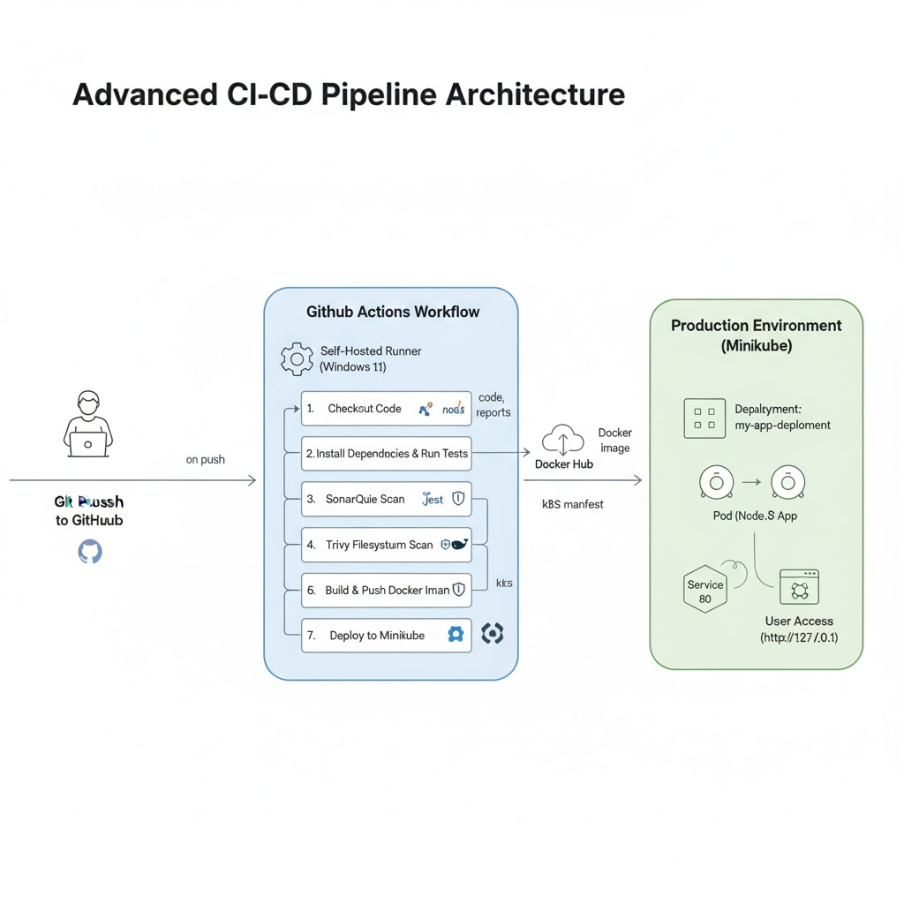
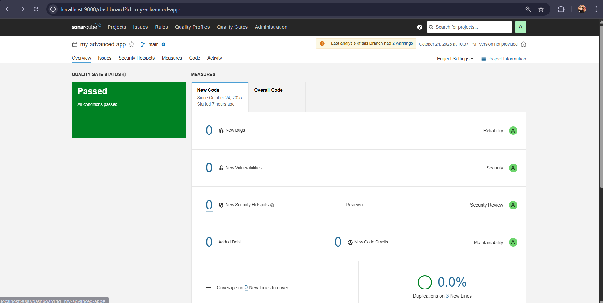
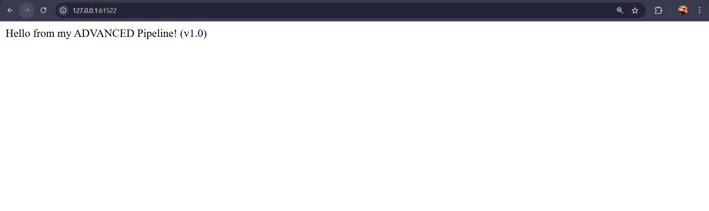

# Advanced DevSecOps Pipeline for a Node.js Application

This project demonstrates a complete, end-to-end DevSecOps (Development, Security, and Operations) pipeline. The pipeline automatically builds, tests, scans for quality and security, and deploys a containerized Node.js application to a local Kubernetes cluster.

The entire process is triggered by a `git push` and is managed by a **self-hosted GitHub Runner** on a Windows 11 machine.

## Project Architecture 

## Tech Stack & Tools

* **CI/CD:** GitHub Actions
* **Runner:** Self-Hosted Runner (Windows 11)
* **Containerization:** Docker & Docker Hub
* **Orchestration:** Kubernetes (Minikube)
* **Code Quality:** SonarQube
* **Security Scanning:** Trivy
* **Application:** Node.js, Express, Jest

## DevSecOps Workflow Breakdown

This pipeline "shifts left," integrating quality and security checks directly into the automation workflow.

1.  **Commit:** A developer pushes code to the `main` branch.
2.  **CI Trigger:** A self-hosted GitHub Actions runner (running locally) picks up the job.
3.  **Test & Quality:** The runner executes `npm test` to run Jest tests and generate a coverage report. This report is then sent to a local SonarQube instance for static code analysis.
4.  **Build:** A new Docker image is built based on the `Dockerfile`.
5.  **Security Scan (Trivy):**
    * **Filesystem Scan:** Trivy scans the repository for any hardcoded secrets or misconfigurations.
    * **Image Scan:** Trivy scans the newly built Docker image for OS-level vulnerabilities. The build will **fail** if any `CRITICAL` vulnerabilities are found.
6.  **Push:** The approved, secure image is tagged with `latest` and the commit SHA, then pushed to Docker Hub.
7.  **Deploy:** The runner uses `kubectl apply -f k8s-deployment.yml` to deploy the new image to the Minikube cluster, triggering a rolling update.

## Project Artifacts

* **SonarQube Dashboard:** A "Passed" quality gate for the `my-advanced-app` project.
     *(Add your SonarQube screenshot here)*
* **Live Application:** The "Hello World" app, successfully served from the Minikube cluster.
     *(Add your final application screenshot here)*

## How to Run This Project

1.  **Prerequisites:**
    * Docker Desktop
    * Minikube
    * kubectl
    * Trivy
    * Node.js & npm
    * PowerShell 7 (`pwsh`)
2.  **Start Services:**
    * Start SonarQube: `docker run -d -p 9000:9000 --name sonarqube sonarqube:lts-community`
    * Start Kubernetes: `minikube start`
3.  **Configure GitHub:**
    * Fork this repository.
    * Set up a self-hosted runner on your local machine. **Must run from a 64-bit PowerShell terminal.**
    * Add the required repository secrets: `DOCKERHUB_USERNAME`, `DOCKERHUB_TOKEN`, `SONAR_TOKEN`, `SONAR_HOST_URL`.
4.  **Trigger Pipeline:** Push a code change to the `main` branch.
5.  **Access Application:**
    * Once the pipeline succeeds, run `minikube service my-app-service --url`.
    * Paste the provided URL into your browser to see the live app.